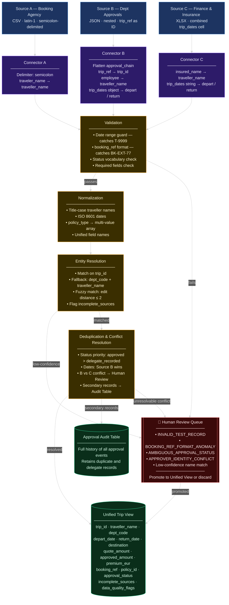

# Design Defence
**Candidate:** Ahmed Tarek | **Exercise:** CISPA Take-home Design Exercise | **Date:** 2026-06-18

---

## Architecture design
Saved `.png` or `.svg` image for the architecture is in images path

## Prompt 1 Named Row Explanation

**T-1078 Yusuf Demir (Research Office, Prague)**

T-1078 was the first thing that caught my attention because it exists in Sources B and C but has no record in Source A at all no quote from the booking agency. The trip was approved (B) and insured (C), so it clearly happened. The `booking_ref = BK-EXT-77` in Source C also breaks the standard `BK-{number}` pattern, which makes me think the trip was booked directly with an external provider, not through the agency. My design flags it as `incomplete_sources` and includes it in the unified view with that flag, while also routing a copy to the human review queue so a data owner can confirm what actually happened here.

**T-1091 Julian Berger (Finance, Amsterdam)**

T-1091 shows up in all three sources, dates match, and the amount is consistent at 700 EUR across Sources A and B. It passes everything and goes straight to the unified view as a fully reconciled record. The one issue I found is in the approval chain in Source B: both Step 1 and Step 2 are attributed to `M. Schmidt`, but with different `approver_id` values `u-2305` and `u-2412`. That's odd. Either there are two people with the same name, or someone has a duplicate account. The trip is still treated as approved since both decisions say approved, but the conflict is flagged as `APPROVER_IDENTITY_CONFLICT` for the data owner to resolve.

**T-1102 Greta Vogt (Human Resources, Copenhagen)**

T-1102 has a duplication problem in Source B two approval records for the same trip: `A-9106` with `status: approved` and `A-9107` with `status: delegate_recorded`. Both have the same `trip_ref`, employee, and dates, so they're clearly the same trip. My design picks `A-9106` as the canonical record using a status priority rule `approved` wins over `delegate_recorded`. But I don't throw `A-9107` away; it goes into the Approval Audit Table so the delegation event is preserved for traceability.

**T-9999 TEST TEST**

This one is easy. T-9999 only exists in Source A as row `Q-6999` `traveler_name = TEST TEST`, `dest_city = TEST`, `depart_date = 2099-01-01`, `quote_amount = 1 EUR`. It has nothing in Sources B or C. My design catches it at the validation layer with a date range guard any departure date beyond current year plus two gets rejected immediately as `INVALID_TEST_RECORD`. It never reaches normalization or reconciliation.

---

## Prompt 2 My Own Pick: T-1084 (Selma Nowak, Biology, Rome)

T-1084 is the record I found most interesting because it stands out in two ways at the same time. Source A has `Q-6104` with `quote_amount = 940 EUR` the highest in the entire dataset by a big margin, the next highest being 700 EUR for T-1091. Source B shows `A-9104` with `total_approved_eur = 940 EUR` and a clean two-step approval from `K. Hartmann` and `S. Wolf`. Source C shows `P-4104` with `policy_type = trip+health` and `premium_eur = 90 EUR` also the highest premium in the dataset, and one of only two records with a combined policy type.

So the record is consistent across all three sources and passes everything cleanly. My design normalizes `policy_type` to a multi-value array `["trip", "health"]` at the normalization layer, which handles this without data loss. The record goes into the unified view as fully reconciled. But the 90 EUR premium compared to the 25–33 EUR range for everyone else raised a question I couldn't answer from the data alone does `premium_eur` always represent the total combined premium, or only the travel portion when a combined policy exists? I think this name can be changed to `eur` or something less confusing.

---

## Prompt 3 What if Source C Became Canonical for Traveller Identity?

Right now Source B is the identity authority it holds the internal approval record tied to the employee who actually requested the trip, which makes it the most reliable source for who travelled. If Source C replaced it, a few things would change.

The most immediate issue is that Source C stores names in all caps `YUSUF DEMIR`, `SELMA NOWAK` so the normalization rule would still title-case everything, but the matching logic would now trust C's version first. More importantly, Source C is a finance and insurance register. It records who was insured, not necessarily who requested or took the trip. An employee could be approved in Source B but insured under a slightly different name in Source C due to a policy error, and the design would now pick the wrong version as canonical. That's a real failure mode that doesn't exist in the current setup.

There's also a new gap that would appear: trips like T-1078 that are approved in B but have unusual records in C (`BK-EXT-77`) would now require C to be the identity authority even when C's own data is questionable. The conflict-resolution rule for dates wouldn't change though Source B stays canonical for trip dates regardless of identity authority, since C's `trip_dates` is a single combined cell and less reliable for date-level precision.

---

## Prompt 4 Questions for the Data Owners

**Question 1 What does `delegate_recorded` mean for approval authority?**
T-1102 has record `A-9107` in Source B where `P. Reinhardt` acted as delegate for `S. Wolf`, with `status: delegate_recorded`. My design treats it as subordinate to the `approved` record in this case. But if a trip only had a `delegate_recorded` record and nothing else, I wouldn't know whether to treat it as approved or not. I'd want to know what this status actually means in the workflow before finalising that rule.

**Question 2 Is the external booking workflow for T-1078 expected and documented?**
T-1078 has no Source A quote and a non-standard `booking_ref = BK-EXT-77`. This suggests the trip was booked outside the agency, but I'm not sure if that's a known exception in the process or an error. If external bookings are a normal thing, there should probably be a separate field or source capturing them and I'd want to know whether more trips like this exist in the full dataset.

**Question 3 Does `premium_eur` in Source C represent the full combined premium for trip+health policies?**
T-1084 has `policy_type = trip+health` and `premium_eur = 90 EUR`, while all standard trip policies are in the 25–33 EUR range. I'm not sure whether 90 EUR is the total for both coverages or just the travel part with health billed separately. This matters because the unified schema currently treats `premium_eur` as a single value regardless of policy type if it means different things depending on the policy, I'd need to handle it differently.
