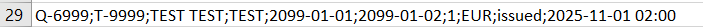
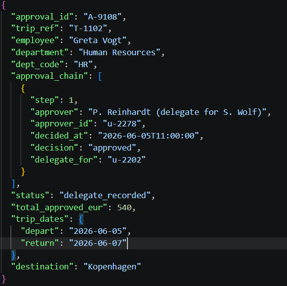
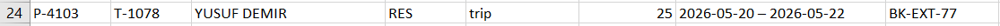

# Data Inspection Notes
**Candidate:** Ahmed Tarek | **Exercise:** CISPA Take-home Design Exercise | **Date:** 2026-06-18

***

## Source A — `source_a_booking_agency_quotes.csv`:

- **Columns:** `quote_id`, `trip_id`, `traveler_name`, `dest_city`, `depart_date`, `return_date`, `quote_amount`, `currency`, `quote_status`, `issued_at`
- **Rows:** 28
- **Delimiter is `;` not `,`** — naive CSV readers will misparse the entire file without explicit `sep=';'` config
- **Anomaly:** Row `Q-6999 / T-9999` is a planted test record: name is `TEST TEST`, city is `TEST`, date is `2099-01-01`, amount is `1 EUR` — clearly not a real business trip

***

## Source B — `source_b_dept_approvals.json`

- **Trip ID field is `trip_ref`** — different from `trip_id` used in A and C; must be mapped at normalization
- **`approval_chain` is nested** — array of step objects inside each record; needs a flattening decision
- **`trip_dates` is a nested object** `{ "depart": ..., "return": ... }` — different structure from C's single combined cell
- **`employee`** is the traveller name field — called `traveler_name` in A and `insured_name` in C
- **Anomaly:** One record has `"status": "delegate_recorded"` — not a standard `approved` / `rejected` / `pending`; ambiguous whether this counts as approval

***

## Source C — `source_c_finance_insurance.xlsx`

- **Columns:** `policy_id`, `trip_id`, `insured_name`, `dept_code`, `policy_type`, `premium_eur`, `trip_dates`, `booking_ref`
- **`trip_dates` is a single combined cell** — unlike Source B which splits depart/return separately
- **`dept_code`** appears in both B and C — useful as a secondary validation key
- **Anomaly:** One `booking_ref` is `BK-EXT-77` — breaks the expected `BK-{number}` pattern; possibly external or manual entry
- **Anomaly:** One `policy_type` is `trip+health` — all others are just `trip`; implies a combined policy

***

## Cross-Source Field Name Mismatches

| Concept | Source A | Source B | Source C |
|---------|----------|----------|----------|
| Trip ID | `trip_id` | `trip_ref` | `trip_id` |
| Traveller name | `traveler_name` | `employee` | `insured_name` |
| Trip dates | two columns: `depart_date`, `return_date` | nested object `trip_dates.depart / .return` | single cell `trip_dates` |
| Department | *(absent)* | `dept_code` | `dept_code` |
| Amount | `quote_amount` | `total_approved_eur` | `premium_eur` |

> **Note:** Amount fields represent different things — A is a pre-approval quote, B is the approved budget, C is the insurance premium. They must not be conflated in the unified schema.

***

## Screenshots

> *(Drop 2–3 screenshots into an `images/` folder and link here)*
> - 

> - 

> - 